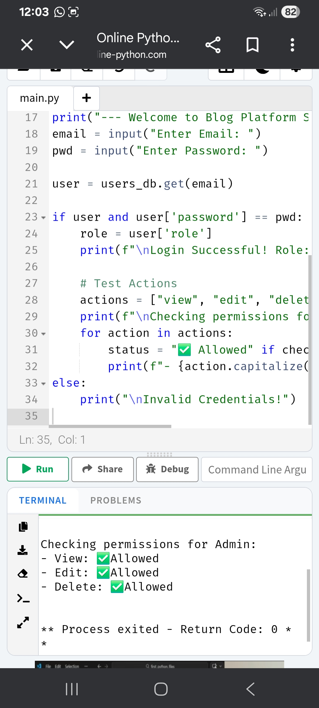
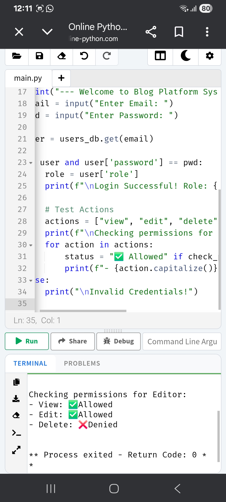
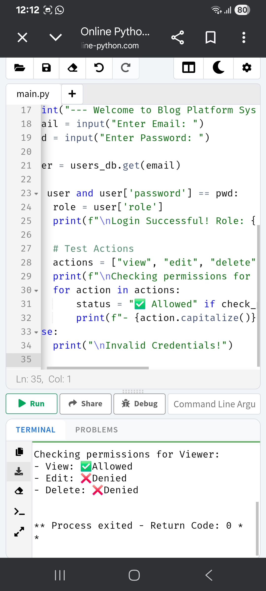

# Responsive Blog Platform

## 👩‍💻 Author
Um E Aimen

## 🚀 Features
- Responsive Blog UI
- Login System
- Role-based access (Admin, Editor, Viewer)
- Clean Design

## 🛠 Technologies
- HTML
- CSS
- JavaScript

## 🌐 Live Demo
(https://aimen2640-oss.github.io/blog-platform-um-e-aimen/)

## 📸 Project Screenshots

### 🔑 Admin Role (Full Access)
In this view, the Admin has permission to View, Edit, and Delete posts.

### 📝 Editor Role (Partial Access)
In this view, the Editor can View and Edit but is denied Delete permissions.

### 👁️ Viewer Role (Read-Only)
In this view, the Viewer can only View posts; Edit and Delete are denied.

